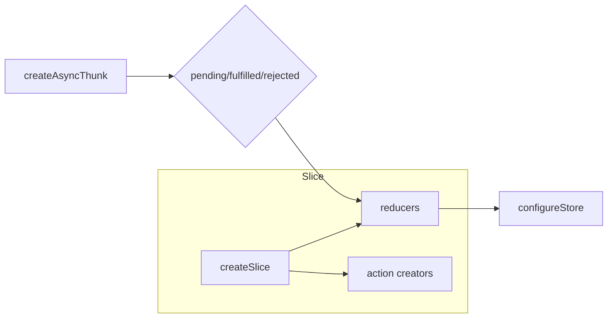

# Redux — Detailed Notes

## Overview
Redux is a predictable state container for JavaScript apps. It centralizes application state in a single store, enforces unidirectional data flow, and makes state changes explicit and traceable through actions and reducers. While small apps may not need Redux, it's useful when:

- You need a single source of truth across many components.
- Multiple components need to read and write shared state.
- You want time-travel debugging, clear traceability, or easier testing of state logic.

Today the recommended approach is to use Redux Toolkit (RTK) which simplifies common patterns and reduces boilerplate.

---

## Core Principles

1. Single Source of Truth: The whole app state lives in one store object.
2. State is Read-Only: The only way to change state is to dispatch an action.
3. Changes are made with Pure Functions: Reducers are pure functions that take previous state and an action and return new state.

---

## Key Concepts

- Store: Holds state and exposes `getState()`, `dispatch(action)`, and `subscribe(listener)`.
- Action: Plain object describing state change, typically `{ type: 'todos/add', payload: {...} }`.
- Reducer: Function `(state, action) => newState` that returns new state immutably.
- Dispatch: Call `store.dispatch(action)` to request a state change.
- Middleware: Wraps dispatch to extend behaviour (logging, async, etc.).

---

## Installation (recommended via RTK)

```bash
npm install @reduxjs/toolkit react-redux
# or
yarn add @reduxjs/toolkit react-redux
```

If you need raw middleware or older patterns:

```bash
npm install redux react-redux redux-thunk
```

---

## Minimal Classic Redux Example (for concept clarity)

```js
// actions.js
export const increment = () => ({ type: 'counter/increment' });

// reducer.js
const initialState = { value: 0 };
export default function counterReducer(state = initialState, action) {
  switch (action.type) {
    case 'counter/increment':
      return { ...state, value: state.value + 1 };
    default:
      return state;
  }
}

// store.js
import { createStore } from 'redux';
import counterReducer from './reducer';
const store = createStore(counterReducer);

store.dispatch(increment());
console.log(store.getState());
```

This demonstrates the core flow: action -> reducer -> new state.

---

## Redux Toolkit (RTK) — Recommended
RTK reduces boilerplate and includes best-practice defaults (Immer for immutability, good devtools setup, opinionated defaults).

Key utilities:
- `configureStore` — sets up store with good defaults.
- `createSlice` — defines reducers + action creators together.
- `createAsyncThunk` — handles async logic with pending/fulfilled/rejected action lifecycle.
- `createEntityAdapter` — helpers for normalized entity state.

### RTK Example (counter)

```js
// features/counter/counterSlice.js
import { createSlice } from '@reduxjs/toolkit';

const counterSlice = createSlice({
  name: 'counter',
  initialState: { value: 0 },
  reducers: {
    increment(state) {
      // Immer lets us write "mutating" code safely
      state.value += 1;
    },
    decrement(state) {
      state.value -= 1;
    },
    incrementByAmount(state, action) {
      state.value += action.payload;
    }
  }
});

export const { increment, decrement, incrementByAmount } = counterSlice.actions;
export default counterSlice.reducer;

// app/store.js
import { configureStore } from '@reduxjs/toolkit';
import counterReducer from '../features/counter/counterSlice';

export const store = configureStore({
  reducer: {
    counter: counterReducer
  }
});

// index.js (React)
import React from 'react';
import { Provider } from 'react-redux';
import { store } from './app/store';
import App from './App';

ReactDOM.render(
  <Provider store={store}>
    <App />
  </Provider>,
  document.getElementById('root')
);
```

### Async with `createAsyncThunk`

```js
import { createSlice, createAsyncThunk } from '@reduxjs/toolkit';

export const fetchUserById = createAsyncThunk(
  'users/fetchById',
  async (userId, thunkAPI) => {
    const resp = await fetch(`/api/users/${userId}`);
    const data = await resp.json();
    return data;
  }
);

const usersSlice = createSlice({
  name: 'users',
  initialState: { entities: {}, status: 'idle', error: null },
  reducers: {},
  extraReducers(builder) {
    builder
      .addCase(fetchUserById.pending, (state) => { state.status = 'loading'; })
      .addCase(fetchUserById.fulfilled, (state, action) => {
        state.status = 'succeeded';
        const user = action.payload;
        state.entities[user.id] = user;
      })
      .addCase(fetchUserById.rejected, (state, action) => {
        state.status = 'failed';
        state.error = action.error.message;
      });
  }
});

export default usersSlice.reducer;
```

RTK handles immutable updates using Immer; reducers can use "mutating" syntax safely.

---

## React Integration

- `Provider` wraps the app to expose the store.
- `useSelector(selector)` reads values from the store (auto subscribes).
- `useDispatch()` returns the `dispatch` function.
- `connect(mapStateToProps, mapDispatchToProps)` is older HOC API; hooks are preferred for function components.

Example component:

```js
import React from 'react';
import { useSelector, useDispatch } from 'react-redux';
import { increment } from './features/counter/counterSlice';

export default function Counter() {
  const value = useSelector((state) => state.counter.value);
  const dispatch = useDispatch();
  return (
    <div>
      <div>{value}</div>
      <button onClick={() => dispatch(increment())}>+</button>
    </div>
  );
}
```

Notes:
- Use `useSelector` with memoized selectors for derived state.
- Avoid selecting large objects every render; prefer granular selections.

---

## Middleware & Side Effects

Middleware wraps the dispatch process. Common middleware:
- `redux-thunk` — simple async logic via thunks (functions returned from action creators).
- `redux-saga` — generator-based side effect model for complex async flows.
- `logger` — logs actions and state for debugging.

RTK's `configureStore` includes good defaults and supports adding middleware easily.

Classic Thunk example:

```js
// an action creator that returns a function
export function fetchTodos() {
  return async (dispatch, getState) => {
    dispatch({ type: 'todos/fetchStart' });
    try {
      const res = await fetch('/api/todos');
      const data = await res.json();
      dispatch({ type: 'todos/fetchSuccess', payload: data });
    } catch (err) {
      dispatch({ type: 'todos/fetchFailure', payload: err.toString() });
    }
  };
}
```

With RTK, prefer `createAsyncThunk` which sets up pending/fulfilled/rejected action lifecycles automatically.

---

## Normalizing State

Keep state normalized (entities map + ids array) to avoid deep nested updates and simplify updates.

RTK provides `createEntityAdapter` to help manage collections efficiently.

---

## Selectors & Memoization

Use `reselect` or RTK's `createSelector` to memoize derived data and avoid recalculations on unrelated updates.

```js
import { createSelector } from '@reduxjs/toolkit';

const selectTodos = (state) => state.todos.entities;
export const selectVisibleTodos = createSelector(
  [selectTodos, (_, filter) => filter],
  (todos, filter) => {
    // expensive computation memoized
    return Object.values(todos).filter(todo => todo.status === filter);
  }
);
```

---

## Debugging

- Use Redux DevTools (RTK enables devtools by default).
- Log actions and state; inspect time travel and action payloads.
- Use `redux-logger` middleware in development.

---

## Testing

- Reducers are pure functions and easy to test: call reducer with state + action and assert result.
- Test thunks with a mock store (e.g., `redux-mock-store`) or test `createAsyncThunk` by mocking fetch and asserting dispatched actions.
- For RTK slices, you can test slices and selectors directly.

---

## Best Practices

- Prefer RTK over hand-rolled Redux for most apps.
- Keep state normalized and minimal (do not store derived values).
- Co-locate related logic in slices.
- Use selectors for derived data and memoization.
- Keep UI state local if it does not need to be shared globally.
- Use RTK Query for server state (caching, invalidation, polling) instead of writing many hand-rolled thunks.

---

## Performance Tips

- Use `useSelector` to select only the needed slice of state.
- Memoize expensive selectors with `createSelector`.
- Use entity normalization to avoid deep copies.
- Avoid storing huge arrays/objects directly on root state for frequently-updated items.

---

## Migration Tips (Classic Redux -> RTK)

1. Replace `createStore` + manual middleware with `configureStore`.
2. Convert reducers + action creators into `createSlice`.
3. Replace hand-written thunk patterns with `createAsyncThunk` when appropriate.
4. Introduce `createEntityAdapter` for collections.
5. Keep tests passing and migrate iteratively per feature.

---

## Example: Full small app snippets

- `store.js` (RTK configureStore)
```js
import { configureStore } from '@reduxjs/toolkit';
import usersReducer from './features/users/usersSlice';

export const store = configureStore({
  reducer: {
    users: usersReducer
  }
});
```

- `usersSlice.js` (entity + async)
```js
import { createSlice, createAsyncThunk, createEntityAdapter } from '@reduxjs/toolkit';

const usersAdapter = createEntityAdapter();

export const fetchUsers = createAsyncThunk('users/fetchAll', async () => {
  const res = await fetch('/api/users');
  return res.json();
});

const usersSlice = createSlice({
  name: 'users',
  initialState: usersAdapter.getInitialState({ status: 'idle', error: null }),
  reducers: {},
  extraReducers: (builder) => {
    builder
      .addCase(fetchUsers.pending, (state) => { state.status = 'loading'; })
      .addCase(fetchUsers.fulfilled, (state, action) => {
        state.status = 'succeeded';
        usersAdapter.setAll(state, action.payload);
      })
      .addCase(fetchUsers.rejected, (state, action) => {
        state.status = 'failed';
        state.error = action.error.message;
      });
  }
});

export default usersSlice.reducer;
```

---

## Common Pitfalls

- Mutating state in non-RTK reducers.
- Storing redundant/derived data in store (e.g., both list and filtered list).
- Selecting large objects causing unnecessary re-renders.
- Overusing global state; prefer local component state for UI-only concerns.

---

## Further Reading

- Official Redux docs: https://redux.js.org/
- Redux Toolkit docs: https://redux-toolkit.js.org/
- React-Redux docs: https://react-redux.js.org/
- Reselect: https://github.com/reduxjs/reselect

---

## Quick Cheatsheet (commands & patterns)

- Install (RTK): `npm install @reduxjs/toolkit react-redux`
- Create store: `configureStore({ reducer: rootReducer })`
- Create slice: `createSlice({ name, initialState, reducers })`
- Async: `createAsyncThunk('slice/fetch', async () => {...})`
- Use in React: wrap app with `Provider`, use `useSelector` & `useDispatch`.


---

If you want, I can also:
- Add a short example app wired into the existing React project in this workspace.
- Create a separate `code/` example folder with a runnable minimal app.
- Expand the notes with diagrams or a migration checklist.

---

## Diagrams

### Redux Data Flow

```mermaid
graph LR
  UI[UI / Component] -->|dispatch(action)| StoreDispatch[store.dispatch]
  StoreDispatch --> Middleware[Middleware (optional)]
  Middleware --> Reducers[Reducers]
  Reducers --> NewState[New state in Store]
  NewState --> Selectors[Selectors / Components re-render]
  Selectors --> UI
```

### RTK Slice & Async Lifecycle



These diagrams show the typical flow from UI events through dispatch, optional middleware, reducers, and back into UI via selectors.

---

## Migration Checklist (Classic Redux -> RTK)

Follow this checklist to migrate safely, one feature at a time.

- [ ] Create a migration branch: `git checkout -b redux-migration`
- [ ] Inventory current Redux usage: reducers, actions, thunks, middleware
- [ ] Install RTK and React-Redux: `npm install @reduxjs/toolkit react-redux`
- [ ] Replace `createStore`/`combineReducers` with `configureStore`
- [ ] Convert a single feature's reducer + actions into a `createSlice`
- [ ] Replace thunks with `createAsyncThunk` where appropriate
- [ ] Introduce `createEntityAdapter` for normalized collections
- [ ] Update selectors, add `createSelector` memoization as needed
- [ ] Add RTK devtools and middleware (keep existing middleware where required)
- [ ] Run unit tests for migrated feature and fix regressions
- [ ] Repeat per feature until all functionality is migrated
- [ ] Remove legacy Redux boilerplate and deprecated code
- [ ] Merge the migration branch after code review

### Commands & tips

```bash
git checkout -b redux-migration
npm install @reduxjs/toolkit react-redux
# migrate one feature, run tests, then commit
```

Notes:
- Commit often and test after each migrated feature to make rollbacks easy.
- Keep legacy code around only until feature tests pass.
- Use feature branches and code review to ensure incremental correctness.

---

If you want, I can convert one feature from `code/` into an RTK slice as a worked example.

